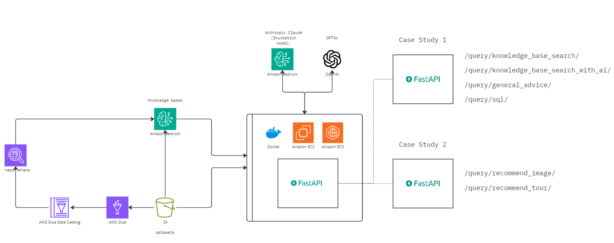

# Building Scalable Generative AI Products: Set up, develop, and deploy production-ready applications with FastAPI, LangChain, and AWS

_Set up, develop, and deploy production-ready applications with FastAPI, LangChain, and AWS_


Welcome to the repository for the “Building Scalable Generative AI Products” course, available at [O'Reilly Learning](https://learning.oreilly.com/). This repository contains all the code and resources needed to learn how to build, test, and deploy scalable generative AI applications using FastAPI, LangChain, and AWS.

The course is structured to guide you through:
 • Setting Up Your Environment: Creating a development setup with all necessary dependencies.
 • Developing the Application: Building a robust knowledge base application using FastAPI.
 • Deploying at Scale: Using Docker, ECS, and EC2 to deploy your applications on AWS.

## Repository Structure

Understanding the folder structure will help you navigate the project easily:

 • `api/`: Contains the FastAPI application code that handles requests, business logic, and routes.
 • `data/`: Stores the datasets used throughout the course.
 • `data_generators/`: Provides scripts and utilities to generate data
 • `interactive/`: Includes code for invoking the knowledge base query flow as well a Jupyter notebook to experiment with the API functions.
 • `.env`: A file (not tracked by version control for security reasons) that contains essential environment variables.
 • `lab_1/`, `lab_2`/, `lab_3/`: Folders for guided labs that walk you through different course stages, complete with example code and instructions.

## Architecture Overview



## Local Development Setup

Follow these steps to set up your local development environment, run the application, and execute tests.

Install dependencies:

 1. Navigate to the FastAPI application folder.
 2. Create a virtual environment and activate it.
 3. Install the required packages from requirements.txt.

```bash
cd api/app
python3 -m venv .venv
source .venv/bin/activate
pip install -r requirements.txt
```

## Running the API

Launch the FastAPI server in development mode. The server automatically reloads upon code changes.

```bash
cd api/app
uvicorn main:app --reload
```

• Note: Once the server is running, the API is available at `http://127.0.0.1:8000`.

Ensure the stability and correctness of your code by running the automated test suite:

```bash
cd api/app
export PYTHONPATH=.   # Ensures Python finds your modules
pytest                # Execute tests using pytest
```

## Knowledge Base Query Flow (Bedrock)

The knowledge base query flow demonstrates how the AI interacts with the built knowledge base. To run this flow:

```bash
cd interactive
python invoke_bedrock_flow.py
```

This script serves as an example of integrating generative AI queries into your application.

## Docker Deployment

Docker simplifies deployment by encapsulating your application environment within containers.

### Building the Docker Image

Use the Dockerfile in the repository to build your image:

```bash
docker build -t oreilly-genai-products .
```

This command creates a Docker image tagged `oreilly-genai-products`.

### Running the Docker Container

Deploy your container locally by mapping the container’s port to your local machine and providing the required environment variables.

```bash
docker run -p 8000:8000 --env-file .env oreilly-genai-products
```

The `-p 8000:8000` flag maps port `8000` inside the container to port `8000` on your host. The `--env-file .env` flag loads environment variables from your `.env` file.

### Environment Variables Configuration

Your `.env` file (kept out of version control for security) should include the following keys:

```yml
[default]
AWS_ACCESS_KEY_ID=[your_aws_access_key]
AWS_SECRET_ACCESS_KEY=[your_aws_secret_key]
AWS_REGION=[your_aws_region]
OPENAI_API_KEY=[your_openai_api_key]
KNOWLEDGE_BASE_ID=[knowledge_base_id]
LANGFUSE_PUBLIC_KEY=[your_langfuse_public_key]
LANGFUSE_SECRET_KEY=[your_langfuse_secret_key]
```

Replace the placeholders with your actual credentials. These keys ensure your application can authenticate with AWS, OpenAI, and other services.

### AWS Deployment

There are two main options to deploy your application on AWS: using Amazon ECS or deploying it to an EC2 instance.

### Deploying via Amazon ECS

1. Tag and Push the Docker Image:
Follow AWS ECS guidelines to tag the Docker image for your ECR repository, then push the image.
2. Deploy the Container:
Create a new container in ECS, configure it with environment variables (from your `.env` file), and deploy it to your AWS cluster.

### Additional Steps for M1 Macs

If you are using an M1 Mac, compile the Docker image for both AMD64 and ARM64 architectures with the following command:

```bash
docker buildx build --platform linux/amd64,linux/arm64 \
    -t 771108160029.dkr.ecr.eu-central-1.amazonaws.com/oreilly-genai-products2:latest \
    --push .
```

This command builds a multi-platform image and pushes it to your ECR repository.

### Deploying on Amazon EC2

To deploy on EC2, follow these step-by-step instructions:

1. Launch an EC2 Instance:

 • Choose an instance type suitable for your workload.
 • Ensure that the security group allows inbound traffic on port 8000.

2. Access the Instance:

```bash
chmod 400 fastapi-deploy-demo.pem  # Secure your PEM key (replace with your actual key)
ssh -i "fastapi-deploy-demo.pem" ec2-user@<your_ec2_public_dns>
sudo yum update -y                # Update package lists
```

3. Install Docker on EC2:

```bash
amazon-linux-extras install docker
sudo service docker start
```

4. Add Your User to the Docker Group:

```bash
sudo usermod -a -G docker ec2-user
```

5. Configure the AWS CLI (Optional):

```bash
aws configure  # Enter your AWS credentials and settings when prompted
```

6. Pull and Run the Docker Image:

```bash
docker pull <IMAGE_URI>  # Replace <IMAGE_URI> with the image URI from your ECR repository
docker run -p 8000:8000 --env-file .env <IMAGE_URI>
```

 • Note: Make sure that the EC2 instance’s security group permits access to port 8000. The API will be accessible through the public IP assigned to your EC2 instance.

## Summary

This documentation offers a comprehensive guide for:
 • Setting up a local development environment using FastAPI.
 • Running and testing the API locally.
 • Using Docker to containerize and deploy your application.
 • Deploying to AWS via ECS and EC2, including special instructions for M1 Macs.

By following these instructions, you will be able to develop, test, and deploy scalable generative AI applications effectively. For any additional details or troubleshooting, refer to the official documentation for FastAPI, Docker, and AWS.
